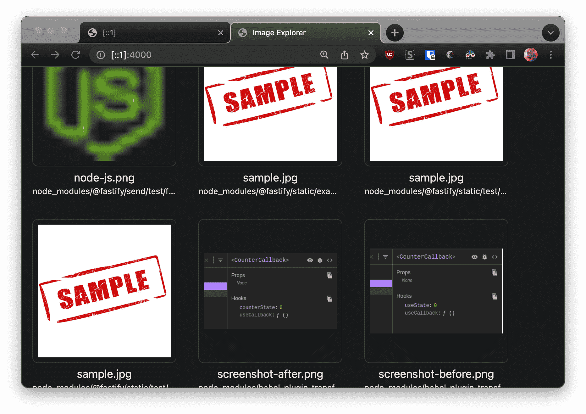

# img-finder
[](https://www.npmjs.com/package/img-finder)
[](https://www.npmjs.com/package/img-finder)


`img-finder` is a small utility library designed to help users find images "visually" in a directory with ease. It provides a simple and quick solution to the tedious task of manually searching through all subfolders of a folder to find a single image.

 
## How to use

Using `img-finder` is quite simple. All you need to do is navigate to the directory you want to search for images in and run the following command in your terminal. (Assuming you already have npm installed)

```bash
npx img-finder -p 4000
```

This command will start the `img-finder` utility and open the `img-finder` interface on port 4000 which will display all the images in the directory in a grid layout, making it easy to visually scan through them.
